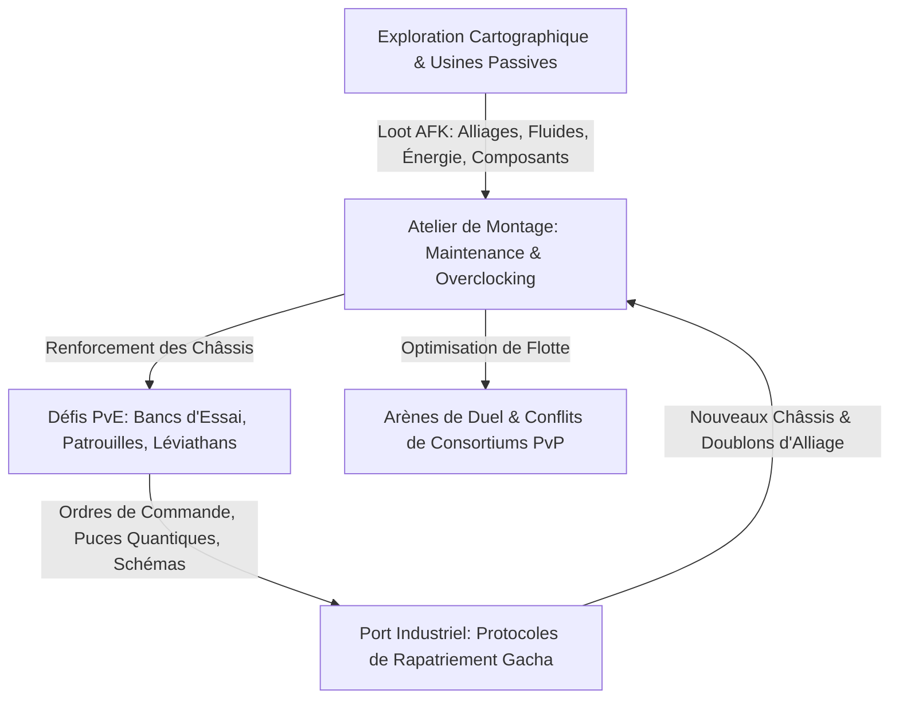

# Cars x Battle : Bible de Game Design & Architecture Système Exhaustive
*Framework Idle RPG Gacha Hard Sci-Fi / Véhicules Tactiques Autonomes & Univers Industriel.*

---

## Sommaire

1. [Vision Thématique & Piliers de Game Design](#1-vision-thématique--piliers-de-game-design)
2. [Boucle Centrale de Gameplay & Architecture Systémique](#2-boucle-centrale-de-gameplay--architecture-systémique)
3. [Système de Combat Automatisé (Simulation Tactique)](#3-système-de-combat-automatisé-simulation-tactique)
4. [Constructeurs Industriels (Factions) & Auras de Flotte](#4-constructeurs-industriels-factions--auras-de-flotte)
5. [Archétypes & Rôles Stratégiques des Châssis](#5-archétypes--rôles-stratégiques-des-châssis)
6. [Roster, Évolution & Système d'Ascension (Overclocking)](#6-roster-évolution--système-dascension-overclocking)
7. [Équipements Modulaires, Processeur Central & Instruments de Pointe](#7-équipements-modulaires-processeur-central--instruments-de-pointe)
8. [Matrice de Rapatriement (Gacha), Fonderie & Marchés](#8-matrice-de-rapatriement-gacha-fonderie--marchés)
9. [Modes de Jeu PvE (Campagne, Donjons & Rogue-lite)](#9-modes-de-jeu-pve-campagne-donjons--rogue-lite)
10. [Modes de Jeu PvP & Championnats Inter-Secteurs](#10-modes-de-jeu-pvp--championnats-inter-secteurs)
11. [Consortiums d'Alliances (Guildes) & Ingénierie de Flotte](#11-consortiums-dalliances-guildes--ingénierie-de-flotte)
12. [Harmonisation Neurale IA (Serment) & Châssis d'Apparat](#12-harmonisation-neurale-ia-serment--châssis-dapparat)
13. [Économie Globale & Rotation Stratégique des Événements](#13-économie-globale--rotation-stratégique-des-événements)

---

## 1. Vision Thématique & Piliers de Game Design

### 1.1. Identité & Transposition
**Cars x Battle** transpose l'intégralité des boucles mathématiques, des synergies d'équipe et des mécaniques d'ascension éprouvées des références du genre (*Girls x Battle 2* / *Idle Heroes*) dans un univers **Hard Sci-Fi / Industriel Inanimé** sans compromis :
- **Entités Déployées :** Fini les campus scolaires ou les héroïnes anthropomorphiques. Le joueur commande une division de **Châssis Mécaniques Transformables**, d'**Engins Autonomes de Combat**, de **Plateformes de Siège Lourdes** et d'**Unités Cybernétiques Mobiles**.
- **Magie $\rightarrow$ Science Fondamentale :** Les sorts et aptitudes magiques sont remplacés par des **Dispositifs Électromagnétiques, Faisceaux Plasma, Canons Cinétiques, Émetteurs Fréquentiels, Algorithmes de Surcharge CPU** et **Nano-Drones de Réparation**.
- **Ambiance Visuelle & Sonore :** Hangars haute technologie, télémétrie holographique, bruits d'engrenages, décharges de condensateurs et interfaces industrielles épurées avec dark mode et glassmorphism.

---

## 2. Boucle Centrale de Gameplay & Architecture Systémique



### Principes Directeurs
1. **Simulation Asynchrone :** Déroulement des combats 100% calculé côté serveur / moteur de simulation pour garantir une équité parfaite en PvP et empêcher toute triche.
2. **Gestion de Stock & Événements Hebdomadaires :** La progression optimale récompense les commandants qui accumulent leurs ressources pour les injecter au moment des cycles d'événements programmés.
3. **Synergies d'Ingénierie :** Aucune unité ne domine seule ; la victoire découle de l'harmonisation des constructeurs, du placement tactique et du calibrage des fréquences d'armement.

---

## 3. Système de Combat Automatisé (Simulation Tactique)

### 3.1. Grille de Déploiement (6 Positions)
Le champ de bataille dispose de 6 emplacements répartis en deux lignes distinctes :
- **Ligne Avant (Frontline - 2 Châssis) :**
  - *Position F1 (Point de Contact Principal) :* Encaisse la quasi-totalité des tirs balistiques standards. Réservée aux blindés à haute intégrité structurelle ou dotés de boucliers réactifs.
  - *Position F2 (Appui Rapproché) :* Zone semi-abritée pour unités d'assaut mobiles ou châssis infligeant des ripostes à courte portée.
- **Ligne Arrière (Backline - 4 Châssis) :**
  - *Positions B1 à B4 (Postes d'Appui & d'Artillerie) :* Protégées des tirs directs conventionnels. Réservées aux pièces d'artillerie lourde, intercepteurs de précision et plateformes de nano-soutien.

### 3.2. Séquence de Combat & Accumulateur de Charge (Énergie)
- **Vitesse de Traitement (CPU Speed) :** Détermine l'ordre chronologique d'activation de chaque châssis à chaque round.
- **Jauge d'Énergie / Condensateur (0 à 100 unités) :**
  - Chaque châssis commence le combat à **50 points d'énergie** (ou 100 avec un module de précharge rapide).
  - Une salve balistique standard réussie génère **+50 points de charge**.
  - Chaque impact direct subi alimente le condensateur de **+10 à +20 points**.
  - À **100 points**, le châssis déclenche immédiatement son **Aptitude Majeure (Protocole d'Armement Lourd / Outil Scientifique)**, remettant la jauge à zéro (le surplus d'énergie est converti en surtension de dégâts).

### 3.3. Tableau Exhaustif des Statistiques Mathématiques

| Statistique | Désignation Technique | Impact en Combat |
|---|---|---|
| **HP (Intégrité de Coque)** | Santé Structurelle | Dégâts maximaux encaissables avant désactivation du châssis. |
| **ATK (Puissance Balistique / Faisceau)** | Sortie Énergétique / Calibre | Valeur de base servant au calcul des tirs et de la puissance de réparation. |
| **ARMOR (Blindage Composite)** | Résistance aux Chocs | Réduction en pourcentage des impacts physiques et cinétiques reçus. |
| **SPEED (Vitesse de Calcul & Propulsion)** | Fréquence Processeur & Moteur | Détermine la priorité d'initiative au début de chaque cycle de combat. |
| **CRIT RATE (Taux d'Impact Critique)** | Précision Balistique Critique | Probabilité d'atteindre un point vulnérable structurel. |
| **CRIT DMG (Amplification Thermique / Choc)** | Multiplicateur Critique | Multiplicateur de dégâts sur coup critique (base 150%). |
| **PRECISION (Précision Télémétrique)** | Guidage Optique & Radar | Neutralise directement le taux de Déflexion/Parade de la cible adverse. |
| **BLOCK (Déflexion / Bouclier Réactif)** | Parade Électromécanique | Probabilité de dévier un projectile, réduisant les dégâts subis de 33%. |
| **ARMOR BREAK (Perforation de Blindage)** | Pénétration Cinétique | Ignore un pourcentage du blindage composite de la cible. |
| **DAMAGE REDUCTION (Atténuation Globale)** | Barrière Déphasée Passive | Réduction brute en % de tous les dégâts reçus (plafond strict à 70-75%). |
| **CONTROL IMMUNE (Résistance IEM)** | Blindage Faraday & Firewall | Probabilité d'ignorer complètement les effets de neutralisation électronique. |
| **SKILL DMG (Surtension de Protocole)** | Amplification d'Ultime | Augmentation en pourcentage des dégâts de l'Aptitude Majeure. |
| **TRUE DAMAGE (Dégâts Bruts / Fission)** | Dégâts à Énergie Pure | Dégâts perforant intégralement l'armure et l'atténuation défensive. |

### 3.4. Statuts & Perturbations Électroniques (Crowd Control)
- **Neutralisations Lourdes :**
  - *Impulsion IEM (Stun) :* Bloque complètement les processeurs du véhicule pendant X tours.
  - *Cryo-Verrouillage (Freeze) :* Gèle les actionneurs mécaniques ; rend la cible sensible aux attaques à choc thermique.
  - *Surcharge Magnétique (Petrify) :* Immobilise le châssis et draine toute alimentation électrique (aucun gain d'énergie).
  - *Brouillage Électromagnétique (Silence) :* Désactive les armes lourdes (l'unité est restreinte aux tirs primaires même à pleine charge).
  - *Verrouillage Radar (Taunt) :* Force les capteurs ennemis à cibler uniquement l'unité provocatrice.
- **Dégâts Continus (DoT) :**
  - *Brûlure Plasma (Burn)*, *Corrosion Acide (Poison)*, *Fissuration Métallique (Bleed)* : Dégâts infligés au début/fin de round, calculés sur l'ATK du tireur, ignorant l'armure.
- **Champs & Barrières :**
  - *Bouclier Électrodynamique (Shield) :* Enveloppe énergétique absorbant les dégâts avant entame de la coque.
  - *Rupture Structurelle :* Réduction permanente du blindage de la cible par tirs répétés.

---

## 4. Constructeurs Industriels (Factions) & Auras de Flotte

### 4.1. Les 6 Méga-Corporations de Châssis

```
                          [DarkMatter Orbital]
                                   ↕  (Contre-attaque Mutuelle)
                          [StellarAegis Prime]

                                   ▲
                                   │
              ┌────────────────────┴────────────────────┐
              │                                         │
     [CyberKinetic Corp]   ──────►   [IronForge Heavy]
              ▲                                         │
              │                                         ▼
     [SolarPulse Dynamics] ◄──────   [BioMech Industries]
```

1. **CyberKinetic Corp (Bleu / Cyan - ex-Ghost) :**
   - *Spécialité :* Guerre électronique, nanocorrosion, drones furtifs et réactivation de châssis détruits.
2. **IronForge Heavy Industries (Acier / Orange Métal - ex-Human) :**
   - *Spécialité :* Blindages en tungstène, canons de très gros calibre, neutralisation IEM et tirs critiques dévastateurs.
3. **BioMech Industries (Rouge / Ocre - ex-Monster) :**
   - *Spécialité :* Systèmes hybrides organo-mécaniques, autoréparation brutale, contre-attaques réactives et force motrice démesurée.
4. **SolarPulse Dynamics (Vert Émeraude / Or - ex-Fairy) :**
   - *Spécialité :* Énergie propre, boucliers à diffraction, brouillage radio, régénération d'énergie d'équipe et modulations de fréquence.
5. **DarkMatter Orbital (Violet Profond / Noir - Faction d'Élite - ex-Demon) :**
   - *Spécialité :* Technologies à antimatière interdites, drainage absolu des condensateurs ennemis, dégâts bruts de fission.
6. **StellarAegis Prime (Doré / Blanc Radiant - Faction d'Élite - ex-Angel) :**
   - *Spécialité :* Barrières d'invulnérabilité stellaire, purification instantanée des IEM, amplification technologique globale.

### 4.2. Matrice d'Avantage Technologique
- **Boucle des 4 Constructeurs :** `CyberKinetic` $\rightarrow$ `IronForge` $\rightarrow$ `BioMech` $\rightarrow$ `SolarPulse` $\rightarrow$ `CyberKinetic`.
- **Dualité Cosmique :** `DarkMatter` $\leftrightarrow$ `StellarAegis` (dégâts mutuels amplifiés).
- **Modificateur d'Avantage :** **+30% de Dégâts Bruts** et **+15% de Précision Télémétrique** contre le constructeur dominé.

### 4.3. Protocoles d'Auras de Flotte (Synergies de Composition)
- **Monoflotte (6 Châssis du même constructeur) :** +20% HP Structurels, +15% Puissance ATK, +Bonus Factionnel (+10% Résistance IEM ou +5% Critique).
- **Spectre Complet (Rainbow - 1 de chaque Constructeur) :** +10% HP, +10% ATK, +10% Résistance IEM.
- **Alliance Industrielle (3+3 Constructeurs) :** +13% HP, +9% ATK.
- **Suprématie Cosmique (3 DarkMatter + 3 StellarAegis) :** +20% HP, +16% ATK, +15% Résistance IEM.

---

## 5. Archétypes & Rôles Stratégiques des Châssis

| Archétype (Classe) | Rôle Tactique Principal | Comportement & Attributs Mécaniques |
|---|---|---|
| **Avant-Garde Lourde (Tanks)** | Absorption massive, Provocation, Ligne 1 | Blindage composite supérieur, absorption d'énergie cinétique, contre-mesures IEM sur la ligne avant. |
| **Unités d'Assaut (DPS Direct)** | Pénétration de ligne, DPS continu | Calibres perforants, haute précision, tirs multi-cibles réduisant le blindage adverse. |
| **Intercepteurs & Éclaireurs (Assassins)** | Frappes chirurgicales, Élimination de cibles prioritaires | Vitesse et taux critique extrêmes ; contournent la ligne avant pour frapper les châssis ennemis les plus fragiles. |
| **Artillerie & Siège (AoE / Contrôle)** | Bombardement de zone, Neutralisation de masse | Salves de missiles et faisceaux plasma frappant les 6 cibles, diffusion de brouillage IEM et réduction de vitesse. |
| **Laboratoires Mobiles (Support / Réparation)** | Nano-réparation, Dépollution IEM, Surtension d'énergie | Déploiement d'essaims de drones réparateurs, amplification de la cadence de tir alliée, dissipation des altérations. |

---

## 6. Roster, Évolution & Système d'Ascension (Overclocking)

### 6.1. Hiérarchie des Châssis (1★ à 15★ / LB5)
- **1★ à 3★ (Composants de Récupération) :** Envoyés immédiatement au compacteur de la Fonderie pour générer de l'Alliage Raffiné.
- **4★ (Sous-Ensembles Industriels) :** Nécessaires pour assembler des prototypes 5★ dans l'Atelier d'Assemblage.
- **5★ (Prototypes Opérationnels) :** Le socle de base de tout châssis de combat performant.
- **6★ à 10★ (Châssis Lourds de Série) :** Montée en puissance débloquant les versions avancées des protocoles d'armement.
- **Limit Break 1 à 5 (LB1 à LB5 / Étoiles Roses / Overclocking) :** Débridage des processeurs quantiques et déverrouillage de micro-codes tactiques.

### 6.2. Recettes d'Ascension & Fusion de Châssis

```
[Assemblage 6★] :
├── 2x Châssis 5★ identiques (Prototype cible)
├── 1x Châssis 5★ spécifique du même Constructeur
└── 3x Châssis 5★ quelconques du même Constructeur

[Ascension 7★] : 6★ cible + 4x 5★ même Constructeur
[Ascension 8★] : 7★ cible + 1x 6★ même Constructeur + 3x 5★ même Constructeur
[Ascension 9★] : 8★ cible + 1x Copie 5★ cible + 1x 6★ même Constructeur + 2x 5★ même Constructeur
[Ascension 10★] : 9★ cible + 2x Copies 5★ cible + 1x 6★ même Constructeur + 1x 9★ générique (tous Constructeurs)

[Overclocking Quantique - Limit Break 1 à 5 (LB1 à LB5)] :
├── LB1 (Niveau max 260) : 10★ cible + 1x Copie 5★ cible + 1x 9★ générique
├── LB2 (Niveau max 270) : LB1 cible + 1x Copie 5★ cible + 1x 9★ générique
├── LB3 (Niveau max 290) : LB2 cible + 1x 10★ générique
├── LB4 (Niveau max 310) : LB3 cible + 1x Copie 5★ cible + 1x 10★ générique
└── LB5 (Niveau max 330/350) : LB4 cible + 1x Copie 5★ cible + 1x 10★ générique
```

### 6.3. Micro-Codes de Potentiel (Talents Limit Break)
Chaque niveau d'Overclocking permet de configurer un protocole logiciel spécifique avant chaque mission :
- **Niveau LB1 (Calibrage de Rendement) :** +12% Puissance d'Armement (ATK) OU +15% Intégrité de Coque (HP).
- **Niveau LB2 (Blindage Électronique) :** +15% Dégâts Critiques OU +20% Résistance IEM OU +10% Réduction de Dégâts.
- **Niveau LB3 (Protocole de Purge Automatique) :** Décharge automatique d'une altération d'état à la fin de chaque round OU Déploiement d'un blindage réactif à l'encaissement d'un tir critique.
- **Niveau LB4 (Télémétrie Avancée) :** Augmentation ciblée de la perforation de blindage et de la précision radar.
- **Niveau LB5 (Protocole Dernier Recours - Survie Extrême) :**
  - *Option A (Surtension d'Urgence) :* Sur coup fatal, maintient la coque à 1 HP, devient invulnérable 1 tour et décharge instantanément son aptitude majeure.
  - *Option B (Rétro-Alimentation d'Épave) :* Régénère 35% de HP maximum à chaque destruction d'un allié ou d'un ennemi.

---

## 7. Équipements Modulaires, Processeur Central & Instruments de Pointe

### 7.1. Les 4 Modules d'Équipement Standard
1. **Module d'Armement (Slot 1) :** Canons cinétiques, projecteurs plasma, gatlings rotatives $\rightarrow$ Boost d'ATK et Dégâts de Compétence.
2. **Blindage de Structure (Slot 2) :** Plaques de titane réactives, cloisons en nanotubes de carbone $\rightarrow$ Boost de HP et Réduction des Dégâts.
3. **Propulsion & Châssis Roulant (Slot 3) :** Propulseurs ioniques, moteurs magnétiques à haut couple $\rightarrow$ Vitesse de Déplacement et PV.
4. **Dispositif Télémétrique (Slot 4) :** Radars Doppler, télémètres laser $\rightarrow$ ATK et Taux de Coup Critique.
- **Sets Dédiés par Archétype (Class Gear) :** Équiper un set 4 pièces calibré pour Avant-Garde Lourde ou Artillerie débloque des multiplicateurs massifs exclusifs à l'archétype.

### 7.2. Processeur Central Quantique (Core CPU Gem)
- Puce quantique évolutive (du niveau Standard 1★ à Quantique Rose).
- **Recalibrage des Registres (Reroll) :** Utilisation de Fluide de Calibrage et de Crédits pour relancer et verrouiller des paires de stats clés (*ex: Vitesse + PV, Coup Critique + Dégâts Critiques, ou Réduction de Dégâts + PV*).

### 7.3. Instruments Scientifiques & Modules de Pointe (Artefacts)
Équipements spécialisés révolutionnant le cours de la bataille :
- **Condensateur à Décharge Rapide (Artefact d'Énergie) :** Confère **+50 Énergie de départ** et **+50% Dégâts d'Ultime** (permet le tir d'artillerie lourde dès le Tour 1).
- **Générateur de Champ Déflecteur :** +30% Réduction de Dégâts, +20% HP Structurels.
- **Processeur d'Overclocking Instantané :** +70 Vitesse CPU, +15% HP (permet de frapper avant les systèmes ennemis).
- **Raffinage d'Instruments Roses (Pink Antiques) :** Amélioration jusqu'à 3 étoiles roses conférant des capacités actives (vol de bouclier, absorption d'énergie, barrière anti-IEM).

---

## 8. Matrice de Rapatriement (Gacha), Fonderie & Marchés

### 8.1. Terminaux de Rapatriement (Invocations)
- **Protocole Standard (Bons de Récupération) :** Châssis 1★ à 3★ (tirages gratuits quotidiens).
- **Protocole Industriel Avancé (Bons de Commande Principaux) :** Châssis 3★ à 5★ (Taux de base 5★ : 1.58%, doublé à 3.16% lors des événements dédiés).
  - *Pity System & Paliers :* Récompenses de paliers garanties à 50, 100, 200, 300, 400 et 500 commandes.
- **Commandes d'Alliance (Réseau de Flottes Amies) :** Invocations via les points d'assistance mutuelle.

### 8.2. Réquisition Ciblée & Transmutation (Sceaux de Constructeur)
- **Matrice de Faction (Sceaux Industriels) :** Choix d'un constructeur exclusif (CyberKinetic, IronForge, BioMech, SolarPulse ou DarkMatter/StellarAegis) pour cibler uniquement ses châssis.
- **Transmutation de Schémas (Reroll 5★) :** Injection de Nanites d'Échange pour convertir un prototype 5★ quelconque en un autre modèle aléatoire du même constructeur.

### 8.3. Centre de Recyclage & Fonderie d'Alliages (Sanctuary / Transfer)
- Compactage des châssis 3★ et 4★ superflus pour récupérer des **Noyaux d'Alliage** et des ressources de maintenance.
- **Magasins d'Échange :**
  - *Boutique du Port Central :* Approvisionnement quotidien en micro-modules, jetons de test et schémas.
  - *Boutique du Consortium :* Achat direct de prototypes d'élite contre des Crédits de Consortium.
  - *Boutique de la Fonderie :* Échange de Noyaux d'Alliage contre des châssis 5★ de pointe.

---

## 9. Modes de Jeu PvE (Campagne, Donjons & Rogue-lite)

### 9.1. Campagne Cartographique & Récolte Turbo (Fast-Reward)
- Exploration systématique de secteurs miniers, friches industrielles et mégapoles cybernétiques.
- Chaque avant-poste conquis augmente le taux de production par minute d'Alliage, de Crédits et de Fluides de Maintenance.
- **Récolte Turbo :** Déclenche instantanément 120 minutes de rendement d'usine passif.

### 9.2. Banc d'Essai Structurel (Tour des 1000 Niveaux)
- 1000 étages de simulations de combat à haute intensité.
- Teste la résistance des formations contre des compositions adverses asymétriques.
- Récompenses majeures de paliers : Châssis 5★ d'élite, Équipements de classe, Sceaux industriels.

### 9.3. Patrouille en Terres Désolées (Wasteland Patrol - Rogue-lite 48h)
- Incursion en territoire hostile renouvelée tous les 2 jours sur 4 niveaux de dangerosité.
- Combats tactiques successifs en 1v1 avec conservation intégrale des PV et de la charge d'énergie.
- Gestion d'un inventaire de survie récupéré sur le terrain :
  - *Injecteurs de Nanogel :* Restauration de 50% ou 100% de coque.
  - *Superchargeurs Électriques :* Recharge immédiate de 100 points d'énergie.
  - *Contrebandiers du Désert :* Vente de composants rares à tarif cassé.

### 9.4. Épreuves de Calibrage des Constructeurs (House Exams)
- 6 simulateurs indépendants restreints chacun aux unités d'un unique constructeur.
- Débloque des fluides de résonance pour amplifier les caractéristiques de base de toute la faction.

### 9.5. Convois d'Expédition Sécurisés (Sanctuary Mode - 15 Étapes)
- Progression tactique à travers 15 checkpoints défendus par des copies de flottes d'autres joueurs.
- Persistance absolue de l'état des unités entre chaque étape.

### 9.6. Missions Autonomes de Reconnaissance (Internship Tasks)
- Envoi de détachements de véhicules en mission automatisée (1h à 12h) nécessitant des critères de châssis spécifiques pour rapporter des Gemmes, Sceaux et Bons de Commande.

---

## 10. Modes de Jeu PvP & Championnats Inter-Secteurs

### 10.1. Banc de Test Public (Arène 1v1 Asynchrone)
- Affrontements quotidiens contre les hangars défensifs des commandants du secteur local.
- Classement ELO dynamique avec dotations journalières et de fin de saison en Gemmes.

### 10.2. Ligue Tactique Tri-Escouades (Varsity 3v3 - 18 Châssis)
- Mobilise 3 escouades complètes de 6 châssis (18 véhicules opérationnels requis).
- Match en 3 manches gagnantes (Best of 3) avec masquage stratégique de la 3ème formation pour déjouer les contre-attaques adverses.

### 10.3. Tournoi Inter-Secteurs Galactique
- Épreuve reine regroupant les meilleurs consortiums de plusieurs clusters de serveurs.
- Qualifications suivies d'un tableau final à élimination directe avec système de paris technologiques pour les spectateurs.

---

## 11. Consortiums d'Alliances (Guildes) & Ingénierie de Flotte

### 11.1. Complexe d'Ingénierie de Flotte (Guild Tech)
- Arbre de recherche scientifique permanent divisé en 5 branches : **Avant-Garde Lourde, Assaut, Intercepteur, Artillerie, Laboratoire Support**.
- L'investissement en Crédits d'Alliance et en Or confère un **bonus universel et définitif** à tous les châssis appartenant à cette catégorie :
  - *Branche Primaire :* PV, ATK, Coup Critique, Déflexion, Dégâts d'Ultime.
  - *Branche Avancée :* Réduction ciblée des dégâts reçus contre des archétypes spécifiques (-30% face à l'Artillerie ennemie), Résistance accrue aux IEM.

### 11.2. Chasse aux Léviathans Mécaniques (Guild Bosses & Raids)
- Affrontements coopératifs quotidiens contre des boss titanesques dotés de barrières régénératrices.
- Répartition des primes d'ingénierie selon le total des dégâts infligés par chaque membre.

### 11.3. Conflits Territoriaux de Consortiums (Guild Wars)
- Guerre stratégique hebdomadaire entre alliances pour le contrôle des usines d'extraction énergétique.

---

## 12. Harmonisation Neurale IA (Serment) & Châssis d'Apparat

### 12.1. Puce d'Harmonisation Maîtresse (Oath / Serment)
- Intégration d'un module d'IA quantique de pointe liant le poste de commandement à un châssis d'élite.
- Débloque :
  - Un châssis d'apparat exclusif "Prototype de Perfection".
  - Des lignes de diagnostics audio et des animations de cockpit personnalisées.
  - Un multiplicateur de caractéristiques permanent (+5% HP, +3% ATK).

### 12.2. Carrosseries & Blindages d'Apparat (Skins)
- Personnalisations cosmétiques de châssis débloquées lors d'événements industriels, conférant des bonus de statistiques cumulatifs.

---

## 13. Économie Globale & Rotation Stratégique des Événements

### 13.1. Tableau des Devises & Ressources

| Ressource | Nature | Utilisation Majeure |
|---|---|---|
| **Gemmes / Cristaux d'Énergie** | Devise Premium | Achats de marché, actualisations de protocole, événements. |
| **Crédits d'Usine (Gold)** | Monnaie Courante | Amélioration de châssis, forge de modules, recherche d'alliance. |
| **Fluide de Maintenance (Juice / EXP)** | Matériau de Montée en Niveau | Augmentation des niveaux standards de coque. |
| **Puces d'Éveil / Soul Crystals** | Matériau de Transition de Tier | Déblocage des paliers de niveau (Tier-up). |
| **Bons de Commande Avancés** | Ticket Gacha Principal | Rapatriement de prototypes 3★ à 5★ lors des événements. |
| **Sceaux Industriels (Seals)** | Ticket de Faction Ciblée | Commandes ciblées par Constructeur et Réquisition d'élite. |
| **Jetons de Simulateur** | Monnaie de Machine à Sous | Tirages de matériaux et fragments dans la salle d'arcade industrielle. |

### 13.2. Calendrier Mensuel des Événements en Rotation (Cycle de 4 Semaines)

```mermaid
gantt
    title Cycle Mensuel des Événements Industriels
    dateFormat  X
    axisFormat  Semaine %d
    section Cycles
    Semaine 1 : Protocole Rapatriement Massif (Capsules x2 & Nouveau Prototype 5★) :0, 7
    Semaine 2 : Simulateur Arcade & Missions Autonomes 6-7★                       :7, 14
    Semaine 3 : Réquisition de Sceaux & Arbre de Faction                          :14, 21
    Semaine 4 : Expédition des Terres Désolées & Échange d'Instruments de Pointe  :21, 28
```

| Cycle | Événement Phare | Comportement Stratégique Recommandé |
|---|---|---|
| **Semaine 1** | **Grand Déploiement Industriel** | Consommer 500 à 2000 Bons de Commande pour obtenir le nouveau Châssis 5★ vedette et ses copies d'ascension. |
| **Semaine 2** | **Simulateur d'Arcade & Missions** | Dépenser les jetons de simulateur accumulés et valider les missions autonomes 6★ et 7★ sauvegardées. |
| **Semaine 3** | **Sceaux de Constructeur & Transmutation** | Investir 80 à 320 Sceaux sur le constructeur prioritaire pour amasser les matériaux d'ascension. |
| **Semaine 4** | **Pillage des Terres Désolées & Bourse Noire** | Récupérer les jetons d'événement via le loot passif et les convertir en Instruments Scientifiques Roses. |
