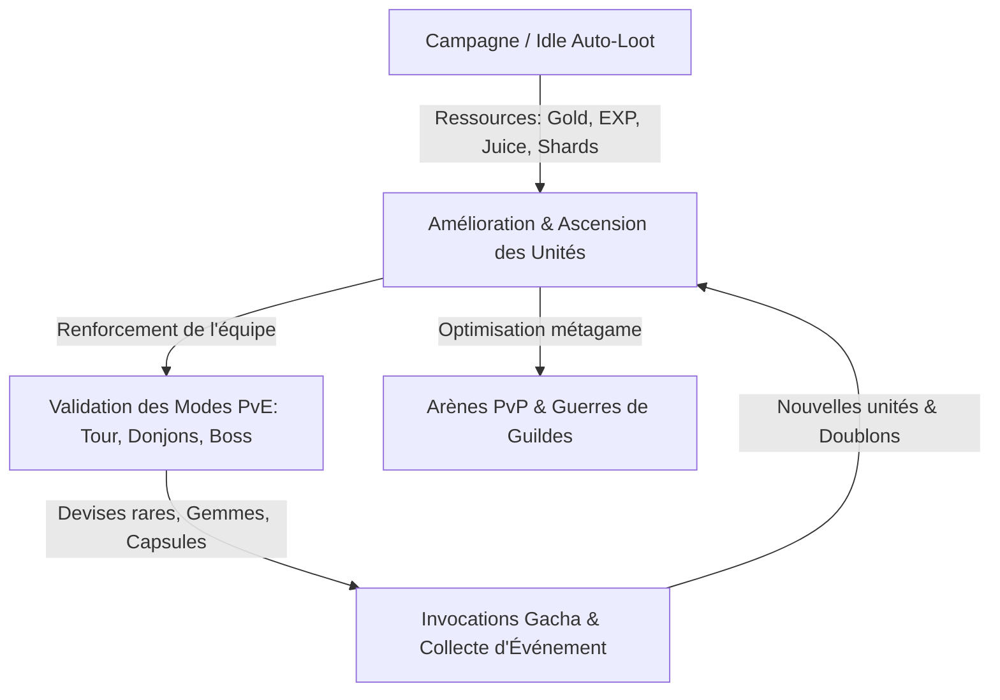

# Girls x Battle 2 (GXB2) : La Bible Exhaustive des Fonctionnalités

> **Objectif de ce document** : Référentiel technique et fonctionnel exhaustif de *Girls x Battle 2* (Idle RPG Gacha de référence, développé sur les bases mathématiques de *Idle Heroes*).  
> Ce document sert de base analytique complète pour la transposition et l'adaptation dans l'univers de **Cars x Battle**.

---

## Sommaire

1. [Architecture Globale & Boucle Centrale (Core Loop)](#1-architecture-globale--boucle-centrale-core-loop)
2. [Système de Combat & Formations Tactiques](#2-système-de-combat--formations-tactiques)
3. [Système de Personnages / Unités (Roster & Ascension)](#3-système-de-personnages--unités-roster--ascension)
4. [Factions, Éléments & Auras d'Équipe](#4-factions-éléments--auras-déquipe)
5. [Classes & Rôles Stratégiques](#5-classes--rôles-stratégiques)
6. [Système d'Équipement, Gemmes d'Âme & Artefacts](#6-système-déquipement-gemmes-dâme--artefacts)
7. [Mécaniques de Gacha, Invocations & Marchés](#7-mécaniques-de-gacha-invocations--marchés)
8. [Modes de Jeu PvE (Aventure, Donjons & Rogue-lite)](#8-modes-de-jeu-pve-aventure-donjons--rogue-lite)
9. [Modes de Jeu PvP & Compétition Inter-Serveurs](#9-modes-de-jeu-pvp--compétition-inter-serveurs)
10. [Système de Guilde & Recherche Technologique](#10-système-de-guilde--recherche-technologique)
11. [Système de Serment (Oath), Intimité & Cosmétiques](#11-système-de-serment-oath-intimité--cosmétiques)
12. [Économie, Rotation des Événements & Boucle de Rétention](#12-économie-rotation-des-événements--boucle-de-rétention)

---

## 1. Architecture Globale & Boucle Centrale (Core Loop)

### 1.1. La Boucle d'Activité


### 1.2. Piliers Fondamentaux
- **Gains Passifs (AFK Looting) :** Génération continue de ressources (Gold, Expérience de compte, Juice/Expérience d'unité, Pièces d'équipement, Fragments) limitée à un plafond temporel (8h à 24h selon VIP).
- **Combat Automatisé Asynchrone :** Déroulement 100% géré par algorithme côté serveur/client sans action manuelle pendant la manche. Toute la profondeur repose sur la préparation : composition, positionnement, synergies de runes et d'artefacts.
- **Gestion et Stockage Rigoureux :** Rétention de ressources clés pour les décharger durant les semaines d'événements dédiés.

---

## 2. Système de Combat & Formations Tactiques

### 2.1. Grille de Déploiement (Formation à 6 Emplacements)
Le champ de bataille comprend deux camps de 6 unités organisés en 2 rangées :
- **Ligne Avant (Frontline - 2 Slots) :**
  - *Slot 1 (F1 - Position Principale) :* Reçoit la grande majorité des attaques de base mono-cibles. Réservé au Tank principal ou aux unités déclenchant des contre-attaques/réductions de dégâts à l'impact.
  - *Slot 2 (F2 - Position Secondaire) :* Zone semi-protégée, idéale pour un DPS résistant ou un bruiser/off-tank.
- **Ligne Arrière (Backline - 4 Slots) :**
  - *Slots 3 à 6 (B1, B2, B3, B4) :* Protégés des coups directs simples. Ciblés uniquement par des attaques de zone (AoE), des compétences ciblant l'arrière-garde, ou les unités à plus bas PV / plus haute attaque.

### 2.2. Dynamique des Tours & Jauge d'Énergie
- **Vitesse (Speed) :** Détermine strictement l'ordre d'action de toutes les unités sur le terrain.
- **Jauge d'Énergie (0 à 100 points) :**
  - Chaque unité démarre le combat avec 50 d'énergie (ou 100 avec un artefact d'énergie).
  - Une attaque de base réussie confère **+50 d'énergie**.
  - Subir une attaque ennemie confère **+10 à +20 d'énergie**.
  - Dès qu'une unité atteint **100 d'énergie**, son action suivante est obligatoirement sa **Compétence Active (Ultime)**, vidant sa jauge à 0 (l'énergie excédentaire au-delà de 100 est convertie en bonus de dégâts pour l'ultime).

### 2.3. Formules Mathématiques & Statistiques Détaillées
Chaque unité est définie par un ensemble complet de caractéristiques :

| Statistique | Rôle & Mécanique |
|---|---|
| **HP (Points de Vie)** | Quantité de dégâts subis avant destruction. |
| **Attack (ATK)** | Base de calcul des dégâts infligés et de la puissance des soins (Heals). |
| **Armor (DEF)** | Réduction en pourcentage des dégâts physiques/cinétiques subis. |
| **Speed (Vitesse)** | Détermine l'ordre d'initiative au début de chaque round. |
| **Crit Rate (Taux Critique)** | Probabilité de porter un coup critique. |
| **Crit Damage (Dégâts Critiques)** | Multiplicateur appliqué aux coups critiques (base 150%). |
| **Precision / Hit** | Augmente les chances de toucher et neutralise directement le taux de Parade (Block) adverse. |
| **Block / Parry** | Probabilité de bloquer une attaque, réduisant ses dégâts de 33%. |
| **Armor Break (Pénétration)** | Ignore un pourcentage de l'armure de la cible. |
| **Damage Reduction (DR)** | Réduction brute en % de tous les dégâts reçus (généralement plafonnée à 70-75%). |
| **Control Immune (Résistance CC)** | Probabilité d'ignorer totalement un effet de contrôle de foule. |
| **Skill Damage (Dégâts de Compétence)** | Pourcentage bonus appliqué aux dégâts de l'Active Skill. |
| **True Damage (Dégâts Bruts)** | Portion de dégâts ignorant totalement l'armure et la réduction de dégâts. |

### 2.4. Système d'Altérations d'État & Contrôles (Crowd Control - CC)
- **Contrôles Durs (Hard CC) :**
  - *Stun (Étourdissement) :* Empêche l'unité d'agir pendant X tours.
  - *Freeze (Gel) :* Empêche l'action ; peut déclencher des synergies de dégâts accrus par certaines unités de glace.
  - *Petrify (Pétrification) :* Bloque l'action et empêche tout gain d'énergie.
  - *Silence :* Empêche le lancement de la compétence active (l'unité effectue une attaque de base même à 100 d'énergie).
  - *Taunt / Provocation :* Force l'ennemi à cibler exclusivement le lanceur.
- **DoT (Dégâts sur la Durée) :**
  - *Bleed (Saignement)*, *Poison (Venin)*, *Burn (Brûlure)* : Dégâts infligés au début ou à la fin de chaque round, indexés sur l'ATK du lanceur, ignorant l'armure.
- **Buffs & Débuffs :**
  - *Armor Shred :* Réduction permanente ou temporaire de l'armure cible.
  - *Mark (Marques) :* S'accumulent sur la cible et explosent après X attaques subies.
  - *Shield (Bouclier temporaire) :* Absorbe un volume de PV avant d'impacter la santé réelle.

---

## 3. Système de Personnages / Unités (Roster & Ascension)

### 3.1. Raretés & Paliers d'Étoiles
Le système de progression s'étend de 1★ à 15★ (Pink Stars / Limit Break) :
- **1★ à 3★ (Fodder de base) :** Unités destinées au recyclage immédiat (Sanctuaire/Transfer) contre des devises.
- **4★ (Matériaux intermédiaires) :** Utilisées pour synthétiser des unités 5★ spécifiques via la Capsule Machine.
- **5★ (Unités de base viables) :** Le standard d'acquisition des héros compétitifs.
- **6★ à 9★ :** Montée en puissance intermédiaire nécessitant des doublons et des sacrifices de même faction.
- **10★ :** Palier majeur débloquant la forme ultime de la compétence active.
- **Limit Break 1 à 5 (LB1 à LB5 / Étoiles Roses) :** Niveaux de transcendance débloquant l'arbre de potentiels.

### 3.2. Formule de Fusion & Recettes d'Ascension (Graduation)

```
[Création 6★] :
├── 2x Copie 5★ de la fille cible
├── 1x Copie 5★ d'une fille spécifique de la même faction
└── 3x Filles 5★ quelconques de la même faction

[Évolution 7★] : 6★ cible + 4x 5★ même faction
[Évolution 8★] : 7★ cible + 1x 6★ même faction + 3x 5★ même faction
[Évolution 9★] : 8★ cible + 1x Copie 5★ cible + 1x 6★ même faction + 2x 5★ même faction
[Évolution 10★] : 9★ cible + 2x Copies 5★ cible + 1x 6★ même faction + 1x 9★ générique (toute faction)

[Limit Break 1 à 5 (LB1 à LB5)] :
├── LB1 (Niveau max 260) : 10★ cible + 1x Copie 5★ cible + 1x 9★ générique
├── LB2 (Niveau max 270) : LB1 cible + 1x Copie 5★ cible + 1x 9★ générique
├── LB3 (Niveau max 290) : LB2 cible + 1x 10★ générique
├── LB4 (Niveau max 310) : LB3 cible + 1x Copie 5★ cible + 1x 10★ générique
└── LB5 (Niveau max 330/350) : LB4 cible + 1x Copie 5★ cible + 1x 10★ générique
```

### 3.3. Arbre de Potentiels (Limit Break Talents)
Chaque palier LB permet au joueur de choisir 1 talent actif/passif parmi 2 ou 3 choix configurables avant chaque combat :
- **Talent LB1 :** Choix entre +12% ATK ou +15% PV.
- **Talent LB2 :** Choix entre +15% Crit DMG, +20% Control Immune, ou Réduction de dégâts.
- **Talent LB3 (Survie) :** Choix entre dissipation automatique d'un débuff à la fin du tour, ou bouclier réactif lors d'un coup critique subi.
- **Talent LB4 :** Augmentation de stats avancées (Armor Break / Hit / HP).
- **Talent LB5 (Ultime de Survie) :**
  - *Exemple :* Immortel pendant 1 tour lors d'un coup fatal (reste à 1 HP et lance son ultime), ou regain massif de PV si les alliés meurent.

---

## 4. Factions, Éléments & Auras d'Équipe

### 4.1. Les 6 Factions
1. **Ghost (Fantôme / Spectre - Bleu/Violet) :** Spécialistes des DoT (Poison/Saignement), débuffs et réanimations.
2. **Human (Humain - Bleu Cyan) :** Spécialistes des contrôles (Stun/Gel), du vol de statistiques et du critique.
3. **Monster (Monstre - Rouge/Orange) :** Axés sur la force brute, la régénération massive et les contre-attaques.
4. **Fairy (Fée / Nature - Vert) :** Spécialistes du soin, des boucliers, du silence et de la manipulation d'énergie.
5. **Demon (Démon - Violet Sombre) :** Faction rare / premium. Dégâts purs dévastateurs, vol d'énergie, malédictions mortelles.
6. **Angel (Ange - Doré / Blanc) :** Faction rare / premium. Invulnérabilité temporaire, résurrections, purifications globales et buffs surpuissants.

### 4.2. Avantage Élémentaire (Triangle & Dualité)
- **Factions Classiques :** `Ghost` $\rightarrow$ `Human` $\rightarrow$ `Monster` $\rightarrow$ `Fairy` $\rightarrow$ `Ghost`.
- **Factions d'Élite :** `Demon` $\leftrightarrow$ `Angel` (se contre-attaquent mutuellement).
- **Bonus d'avantage :** **+30% de dégâts infligés** et **+15% de précision (Hit)** contre la faction dominée.

### 4.3. Auras de Composition d'Équipe (Team Auras)
Déployer des compositions spécifiques octroie des bonus permanents à toute l'équipe :
- **Pure Faction (6 de la même) :** +20% HP, +15% ATK, +Bonus spécifique (ex: +10% CC Resist ou +5% Crit).
- **Rainbow (1 de chaque faction : Ghost + Human + Monster + Fairy + Demon + Angel) :** +10% HP, +10% ATK, +10% Control Immune.
- **Duo 3+3 (ex: 3 Ghost + 3 Monster) :** +13% HP, +9% ATK.
- **Purity Démon/Ange (3 Demon + 3 Angel) :** +20% HP, +16% ATK, +15% Control Immune.

---

## 5. Classes & Rôles Stratégiques

| Classe | Rôle Principal | Caractéristiques Mécaniques |
|---|---|---|
| **Warrior (Guerrier / Tank)** | Absorption des dégâts, Aggro, Provocation | PV et Armure très élevés, ripostes passives, étourdissements ciblés sur les premières lignes. |
| **Ranger (Rôdeur / Tireur)** | DPS constant, Précision, Débuff monocible | Vitesse élevée, perforation d'armure, attaques multi-cibles de base. |
| **Assassin (Assassin / Éclaireur)** | Burst DPS, Finition de cibles faibles | Très haut taux critique, contourne la ligne avant pour cibler la fille avec le moins de PV ou les Priests arrière. |
| **Mage (Mage / Spécialiste)** | Dégâts de Zone (AoE), Contrôle de Foule | Attaques touchant les 6 cibles, gels/silences de masse, réduction de la vitesse ennemie. |
| **Priest (Prêtre / Soutien)** | Soins (Burst & HoT), Buffs d'équipe, Dispels | Restauration de l'énergie des alliés, boucliers d'absorption, dissipation des DoT et débuffs. |

---

## 6. Système d'Équipement, Gemmes d'Âme & Artefacts

### 6.1. Équipement Standard (4 Pièces)
Chaque unité s'équipe de 4 pièces :
- **Weapon (Arme) :** Augmente l'ATK et les dégâts de compétence.
- **Armor (Armure) :** Augmente les HP et la défense brute.
- **Boots (Bottes) :** Augmente la Vitesse et les HP.
- **Accessory (Accessoire) :** Augmente l'ATK et le Taux Critique.
- **Bonus de Set (2, 3 et 4 pièces) :**
  - Ex: Équiper 4 pièces d'un set 6★ confère +20% HP, +16% ATK, +15 Speed.
  - **Class-Exclusive Gear (Set de Classe) :** Sets d'équipement spécifiques (Guerrier, Mage, etc.) conférant des bonus surmultipliés lorsqu'équipés par la bonne classe.

### 6.2. Crystal / Gemme d'Âme (Soul Gem)
- Emplacement de gemme évolutif (du rang 1★ vert au rang max Rose/Légendaire).
- **Système de Reroll :** Les joueurs verrouillent le type de stats souhaité (ex: *Crit Rate + Crit DMG*, *HP + Damage Reduction*, ou *Speed + HP*) et relancent les combinaisons à l'aide de poussière magique et d'or.

### 6.3. Artefacts & Objets Exclusifs (Antiques)
Objets passifs apportant des mécaniques de rupture métagame :
- **Artefacts d'Énergie :** Exemple classique : *Energy +50* et *Skill Damage +50%*. Permet à une unité de lancer son ultime dès le Tour 1.
- **Artefacts de Défense :** +30% Damage Reduction, +20% HP.
- **Artefacts de Vitesse :** +70 Speed, +15% HP (crucial pour les contrôleurs afin de jouer avant l'adversaire).
- **Pink Antiques (Artefacts Éveillés / Raffinés) :** Système d'amélioration en 3 étoiles roses ajoutant des effets uniques (ex: barrière anti-mort, vol de bouclier, suppression d'énergie à l'ennemi).

---

## 7. Mécaniques de Gacha, Invocations & Marchés

### 7.1. Systèmes de Tirage (Capsules)
- **Normal Capsule :** Invocations 1★ à 3★ (gratuites toutes les 8h, tickets courants).
- **Advanced Capsule :** Invocations 3★ à 5★ (taux 5★ ~1.58% à 3.16% pendant les événements x2).
  - Pity System : Nombre de tirages garantissant une unité 5★ d'élite ou des récompenses de paliers (50, 100, 200, 300, 400, 500 tirages).
- **Friendship Summons :** Invocations via les points d'amitié reçus de la liste d'amis.

### 7.2. Faction Summons & Reroll (Seal / Enroll Globes)
- **Arbre d'Inscription (Enroll / Prophecy Tree) :** Consommation de Sceaux (Seals) pour cibler exclusivement une faction déterminée (Ghost, Human, Monster, Fairy, ou Demon/Angel).
- **Échange de Faction (Reroll / Replace) :** Permet de transformer une fille 5★ quelconque en une autre fille 5★ aléatoire de la même faction à l'aide de feuilles sacrées.

### 7.3. Fragmentation & Puzzles
- Possibilité d'assembler des unités à partir de **50 fragments 5★ génériques** ou **50 fragments spécifiques** d'une héroïne précise.

### 7.4. Marchés & Recyclage (Sanctuary / Transfer)
- **Transfer / Sanctuarisation :** Destruction des unités 3★ et 4★ superflues contre des **Soul Stones** et des ressources.
- **Boutiques spécialisées :**
  - *Market général :* Achat journalier de capsules, tickets d'arène, poussière.
  - *Guild Shop :* Échange de pièces de guilde contre des copies spécifiques de filles.
  - *Sanctuary Shop :* Achat direct d'unités 5★ de haut rang contre des Soul Stones.

---

## 8. Modes de Jeu PvE (Aventure, Donjons & Rogue-lite)

### 8.1. Campagne Principale (Campaign)
- Progression linéaire par chapitres et sous-niveaux.
- Chaque niveau franchi augmente le débit de production horaire d'or, d'expérience et d'objets passifs.
- Bouton **Fast-Reward (Récolte Rapide) :** Octroie instantanément 120 minutes de loot passif.

### 8.2. Tour des Épreuves (Tests / Hiking)
- Ascension de 1 à 1000 étages.
- Combats à difficulté exponentielle contre des équipes pré-configurées.
- Récompenses ponctuelles massives (Pierres d'éveil, Équipements 5★/6★, Sceaux, Copies de filles).

### 8.3. La Patrouille / Randonnée (Patrol - Rogue-lite)
- Mode renouvelé toutes les 48 heures divisé en 4 paliers de difficulté (Easy, Normal, Hard, Nightmare/Hell).
- Combats en 1v1 successifs où les PV et l'énergie des filles sont conservés.
- Gestion d'objets consommables trouvés en cours de route :
  - *Potions de soin* (restaure 50% ou 100% HP).
  - *Potions d'énergie* (donne +100 d'énergie).
  - *Marchands secrets* vendant des ressources à prix très réduit.

### 8.4. Les Épreuves de Faction (House Exams)
- Donjons permanents séparés en 6 sections (1 par faction).
- Le joueur ne peut déployer que des unités de la faction requise.
- Récompense des matériaux exclusifs servant à upgrader l'aura élémentaire globale.

### 8.5. Expédition / Sanctuaire (Sanctuary Mode)
- Parcours de 15 étapes consécutives contre des équipes fantômes de vrais joueurs.
- La santé de toute l'équipe est persistante d'un combat à l'autre.
- Gain de devises d'expédition permettant d'acheter des fragments de héros d'élite.

### 8.6. Stages d'Été / Jobs (Internship Quests)
- Envoi de filles en mission passive pour des durées fixes (1h, 2h, 4h, 8h, 12h) avec des exigences de faction et d'étoiles.
- Rapporte des gemmes, des capsules avancées et des sceaux.

---

## 9. Modes de Jeu PvP & Compétition Inter-Serveurs

### 9.1. Junior Varsity (Arène Classique 1v1)
- Matchmaking asynchrone contre la défense enregistrée d'autres joueurs du serveur.
- Système de points ELO et classement avec récompenses quotidiennes et saisonnières en gemmes.

### 9.2. Varsity (Arène 3v3 - Multi-Équipes)
- Nécessite 3 équipes de 6 unités (18 filles au total).
- Affrontement au meilleur des 3 manches (Best of 3).
- Dimension stratégique poussée : cacher la composition de sa 3ème équipe pour piéger l'attaquant.

### 9.3. Ultimate League / Compétitions Inter-Serveurs
- Tournoi d'élite regroupant les meilleurs joueurs d'un groupe de serveurs (Cluster).
- Phases de qualifications puis arbre de tournoi final à élimination directe avec système de paris pour les spectateurs.

---

## 10. Système de Guilde & Recherche Technologique

### 10.1. Guild Lab / Guild Tech (Laboratoire Technologique)
- Arbre de talents passifs séparé en 5 branches de classes (**Warrior, Ranger, Assassin, Mage, Priest**).
- L'investissement en pièces de guilde et en or augmente de manière **permanente et globale** les statistiques de toutes les filles de cette classe :
  - *Palier 1 :* HP, ATK, Crit, Block, Skill Damage.
  - *Palier 2 (Avancé) :* Réduction des dégâts subis face à chaque classe spécifique (ex: -30% dégâts infligés par les Mages), Immunité aux étourdissements.

### 10.2. Boss de Guilde & Raids
- Boss de guilde coopératifs disposant de millions de points de vie.
- Classement des membres selon les dégâts infligés pour l'attribution des pièces de guilde.

### 10.3. Guild War (Guerre de Guildes)
- Affrontement hebdomadaire entre guildes.
- Déploiement des formations de défense par les officiers et attaques planifiées pour maximiser les points de destruction des bases ennemies.

---

## 11. Système de Serment (Oath), Intimité & Cosmétiques

### 11.1. Intimité & Bagues de Serment (Oath Ring)
- Système de progression de lien affectif avec chaque héroïne via l'envoi de cadeaux.
- Offrir une **Bague de Serment (Oath Ring)** débloque :
  - Un skin exclusif de mariage / tenue spéciale.
  - Des dialogues audio et animations interactives additionnelles.
  - Un bonus de statistiques direct et permanent (+5% HP, +3% ATK).

### 11.2. Collection de Skins & Galerie
- Chaque skin acheté ou débloqué lors d'événements apporte des statistiques cumulables à la fille.

---

## 12. Économie, Rotation des Événements & Boucle de Rétention

### 12.1. Les Devises Principales
- **Gems (Gemmes) :** Monnaie premium (achats, rerolls, événements).
- **Gold (Pièces d'or) :** Monnaie d'usage massif pour le leveling, la forge et la tech de guilde.
- **Juice / EXP Pills :** Ressource dédiée au passage de niveau des unités.
- **Soul Crystals (Cristaux d'Éveil) :** Requis pour passer les paliers de tiers (Tier-up).
- **Advanced Capsule Coins :** Tickets d'invocation gacha d'élite.
- **Seals (Sceaux de faction) :** Monnaie pour les tirages ciblés d'éléments.
- **Slot Tickets :** Jetons de la machine à sous (Slot Machine) pour les ressources.

### 12.2. Calendrier Hebdomadaire des Événements en Rotation (4 Semaines)
Le jeu fonctionne sur un cycle prédictible incitant les joueurs à thésauriser leurs ressources :

| Semaine | Événement Majeur | Objectif Joueur |
|---|---|---|
| **Semaine 1** | **Capsule Event (Événement Tirages)** | Dépenser 500 à 2000 Advanced Capsules pour débloquer la nouvelle fille 5★ vedette. |
| **Semaine 2** | **Slot Machine & Internship** | Dépenser des jetons de machine à sous et valider les quêtes d'internship 6★ et 7★ économisées. |
| **Semaine 3** | **Enroll / Seal Event** | Dépenser 80 à 320 Sceaux sur l'Arbre de faction pour obtenir des héros top-tier et des matériaux. |
| **Semaine 4** | **Hiking / Expédition & Échange Spécial** | Collecte d'objets d'événement via le loot passif et conversion en artefacts haut de gamme. |

---

## 🎯 Tableau de Correspondance pour Cars x Battle

| Système GXB2 (Girls x Battle 2) | Transposition dans Cars x Battle |
|---|---|
| **Filles (Girls / Waifus)** | **Châssis Tactiques / Véhicules Mécaniques Transformables** |
| **Sorts & Magie** | **Instruments Scientifiques, Électromagnétisme & Modules Balistiques** |
| **Factions (Ghost, Human, Monster...)** | **Constructeurs / Factions Industrielles (ex: Titan Heavy, CyberKinetic, NanoBio, PulseEnergy...)** |
| **Classes (Warrior, Ranger, Assassin...)** | **Archétypes (Avant-Garde/Tank, Assaut Front, Intercepteur Vitesse, Artillerie Siège, Laboratoire Support)** |
| **Capsule Summons** | **Protocoles de Rapatriement / Bons de Commande Industriels** |
| **Ascension (6★ à 10★ / LB5)** | **Montée en Étoiles / Overclocking & Raffinage de Châssis** |
| **Guild Tech** | **Recherche Technologique de Hangar / Arbre d'Ingénierie de Flotte** |
| **Système de Serment (Oath)** | **Calibrage Optimal / Puce d'Harmonisation IA Maîtresse** |
| **Patrol / Randonnée** | **Patrouille d'Exploration en Terres Désolées (Wasteland Patrol)** |
| **Tests / Tour** | **Banc d'Essai Structurel & Tour de Calibrage** |
